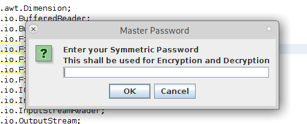
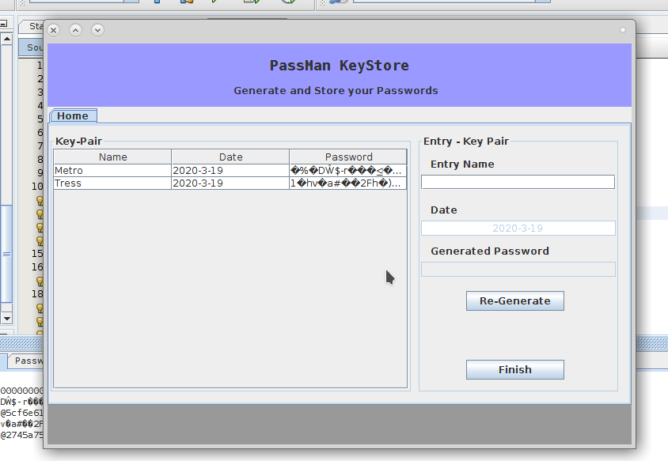

# <u>Password Manager</u>

This is a simple password manager that i wrote for myself and found it worth sharing here. It picks inputs from a user and stores it. The hive storing this. is encrypted using the **aes** algorithm symmetrically. the output of the encryption is further encoded using **base64**.

1. ### Platform 

I wrote this using Java hence can run on all major platforms that run Java. This is good since no porting to other platforms is needed.

Despite this, the application is only supported for *Linux* based Operating Systems, because of the combination generating algorithm

1. ### Executing it 

To execute this binary first clone this repository by

```bash
git clone https://github.com/Niccher/Password-Manager.git

cd Password-Manager/dist

java -jar Password_Manager.jar
```

After executing the above steps, a window is opened.

The first window inquires of a password. this is the only password the user has to remember.

the window  appears like this



The next window is 



1. ### Algorithms


The algodfb